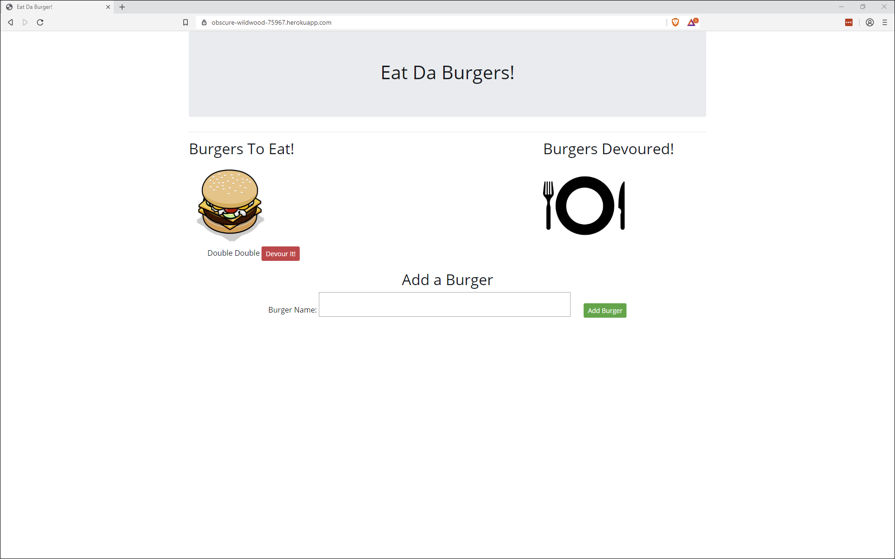

# Eat-Da-Burger

Eat-Da-Burger! is a restaurant app that lets users input the names of burgers they'd like to eat.
](https://www.npmjs.org/package/npm-expansions)

Eat-Da-Burger! is a full-stack single page application built to practice and integrate the use of multiple web development techniques.

#Usuage
Users are able to input the names of burgers they'd like to eat, log it onto a menu, and when eaten, the burgers move to a different part of the screen displaying a list of devoured burgers.

## Technologies and Techniques Used

- Node.js - an event-driven asynchronous Javascript open source server framework

* NPM packages - Including express, for creating server; mysql, for interacting with the SQ database; body-parser, for interpreting and reading data; method-override; and express-handlebars.

- MYSQL Workbench - for creating the local databses connection

- Handlebars - a Javascript templating framework to manage the display of data returned by the server

- MVC design - Model View Controller refers to a method of structuring a web development project into distinct but interconnected parts increasing efficiency and resusability of code.

- ORM - Object Relational Mapping is a technique of accessing relational databases and manages an application's CRUD interacton with a database.
